# Aiven Kafka Quickstart Producer with Python and Json

## Description

In this project, we will showcase how to leverage Aiven's Kafka managed services in order to produce and consume weather data in Json format, by having a full integartion suite from source (Weather Web APIs or local data sets) to sink (Time series database in InfluxDB or any other type of consumer), as well as visualisation and dashboard options with Graphana.

The documnet is intended to be simple in order to help people who are fresh starters with Kafka and Aiven to quickly get a hold on a working real-life example.

### What is Kafka?

[Source: wikipedia]
>Apache Kafka is a framework implementation of a software bus using stream-processing. It is an open-source software platform developed by the Apache Software Foundation written in Scala and Java. The project aims to provide a unified, high-throughput, low-latency platform for handling real-time data feeds.

### How It Works?

[Source: wikipedia]
>Kafka stores key-value messages that come from arbitrarily many processes called producers. The data can be partitioned into different "partitions" within different "topics". Within a partition, messages are strictly ordered by their offsets (the position of a message within a partition), and indexed and stored together with a timestamp. Other processes called "consumers" can read messages from partitions.

<p align="center">
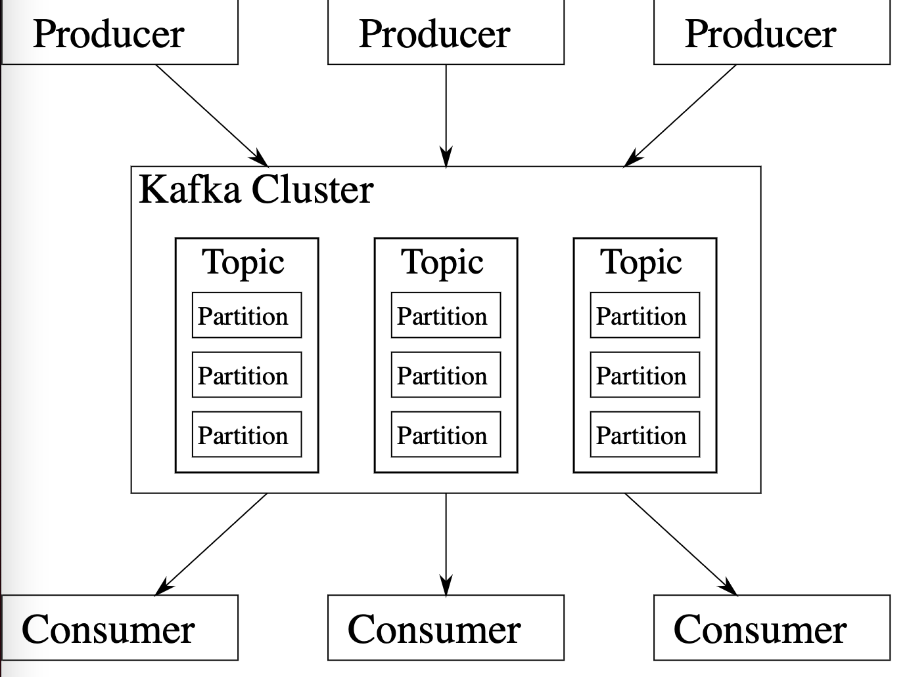
</p>

### What is Aiven Kafka?

[Source: aiven.io]
>Aiven for Apache Kafka® is a fully managed streaming platform, deployable in the cloud of your choice. Snap it into your existing workflows with the click of a button, automate away the mundane tasks, and focus on building your core apps.

## Prerequisites

### Python

Install Python on local machine. Install kafka-python and other dependencies using pip. Example:

```bash
pip3 install kafka-python
```

### Kafka & Zookeper (optional)

For quick testing and troubleshooting purposes, it may be useful to install Kafka on the local machine. We will not go into the details of this process.

start kafka and zookeper on standart ports, Start by creating a new topic, example:

```bash
kafka-topics --bootstrap-server localhost:9092 --topic my_first_topic --create --partitions 3 --replication-factor 1
```

Example of listening to new incoming messages:

```bash
kafka-console-consumer --bootstrap-server localhost:9092 --topic my_first_topic
```

## Simple Kafka Producer

The function below is a simple Kafka producer using kafka-python library;

```Python
def simple_producer(conf, topic_name, key, payload):
    producer = KafkaProducer(**conf)

    message = { 'tag' : 'simple_producer',
        'uuid' : str(uuid.uuid4()),
        'date' : datetime.now().isoformat(),
        'payload' : payload
    }
    
    print("Sending: {}".format(message))
    producer.send(topic_name, key=json.dumps(key).encode('utf-8'), value=json.dumps(message).encode('utf-8'))

    # Wait for all messages to be sent
    producer.flush()
```

We are reading the configuration settings for KafkaProducer (a Kafka client that publish records to a Kafka cluster) from a YAML file and converting them to an arguments list, then using the *send* method for sending asynchrous record to a Kafka topic (represented by *topic_name*).

All is needed to get a message into a Kafka topic is to call the *simple_producer* function by providing it with the topic name, a key and the message itself. So simple!

### Using Real time Weather data

[current_weather_provider.py]
To make the examples more realistic, we are calling an openweathermap API and getting the current weather data for multiple cities around the glob (the list if cities is configurable in a YAML file, so no code change is required!) and then pushing this information in real time fashion thru the topic. The city name is given as a key, which helps with sorting the messages in various partitions inside the same topic..

```Python
while i > 0:
    dict = current_weather_provider()
    for key in dict:
        simple_producer(producer_conf, providers_list['current_weather_data']['topic_name'], key, dict[key])
    i -= 1
```

### Using Sample Json data

Another simpler example is to iterate through local data files, read and push messages thru the Kafka producer. All is needed is jut to add or remove files in the *~/data/* directory.

### Consumer Message Example

The json snippet below shows a message recieved at the consumer end, based on real time data from openweathermap API.

```Json
{"tag": "simple_producer", "uuid": "c50947ec-417d-4e22-86d0-55aa004f51f7", "date": "2022-02-06T01:07:06.593565", "payload": {"coord": {"lon": 24.9355, "lat": 60.1695}, "weather": [{"id": 804, "main": "Clouds", "description": "overcast clouds", "icon": "04d"}], "base": "stations", "main": {"temp": 0.08, "feels_like": -1.4, "temp_min": -0.79, "temp_max": 1.98, "pressure": 989, "humidity": 87}, "visibility": 1400, "wind": {"speed": 1.34, "deg": 234, "gust": 2.68}, "clouds": {"all": 100}, "dt": 1644062332, "sys": {"type": 2, "id": 2028456, "country": "FI", "sunrise": 1644042358, "sunset": 1644072152}, "timezone": 7200, "id": 658225, "name": "Helsinki", "cod": 200}}
```

## Aiven CLI
Simply install Aiven client using this command or similar. Make sure it is in PATH environment variable.
```bash
pip3 install aiven-client
```

Login using the following command:

```bash
avn user login <user@email.com>
```

The Aiven CLI is a powerful tool that let you provision new services from command line and view existing ones. For more details checkout this blog:

>https://aiven.io/blog/command-line-magic-with-the-aiven-cli


## Getting Started with Aiven Kafka

### Creating a new Kafka Service

From The main web console:

- Click on *services*
- Click on *Create new Service*
- Select Apache Kafka, and specify the version
- Select a cloud provider and region
- Select the service plan and note the monthly cost
- Give the new service a name, example *kafka-lab1*
- Monitor the service start and nodes status
- Download the access key, and certificate files for remote connection
- Enable Apache Kafka REST API

<p align="center">
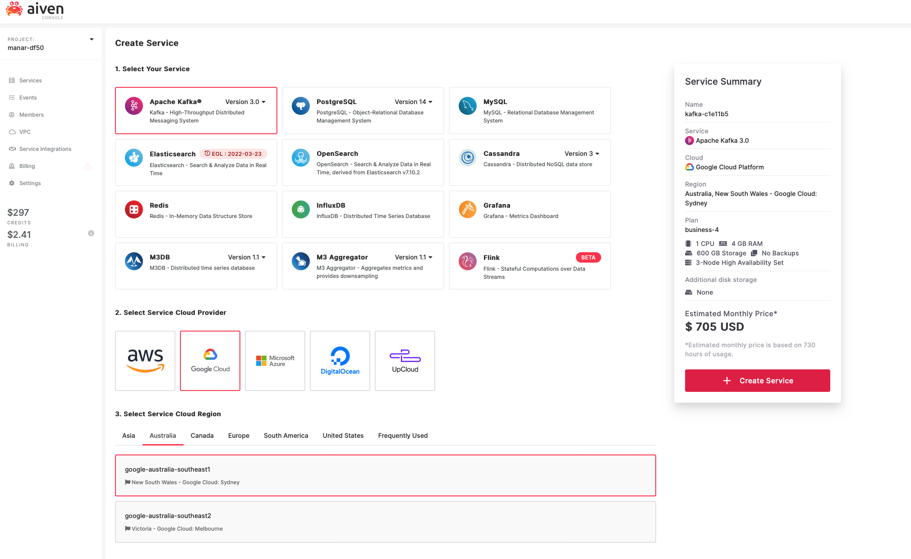
</p>

### Creating Topics

From The Kafka service console, click on the Topics tab, name the topic and specify the partition count, then click *Add topic*.

<p align="center">
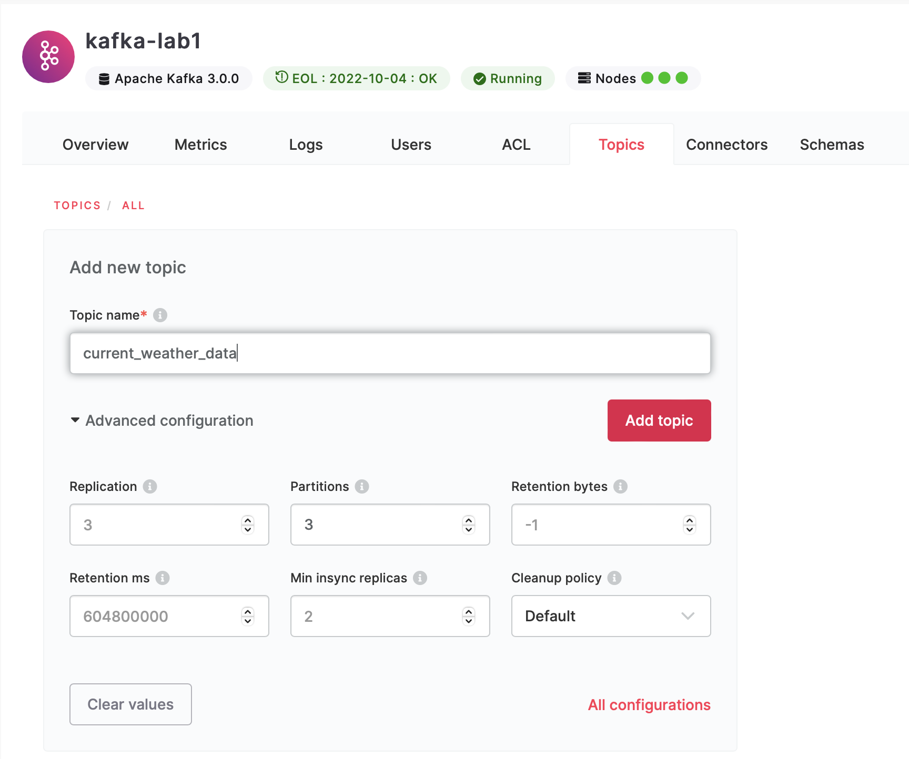
</p>

### View Incoming Messages

From the Kafka service console, click on the Topics tab, select a particular topic and click *Fetch messages*. Select *Decode from base64* for decoding the serialised messages, if needed. You should be able to see list of messages and their related details like keys, offsets, partitions, etc.

<p align="center">
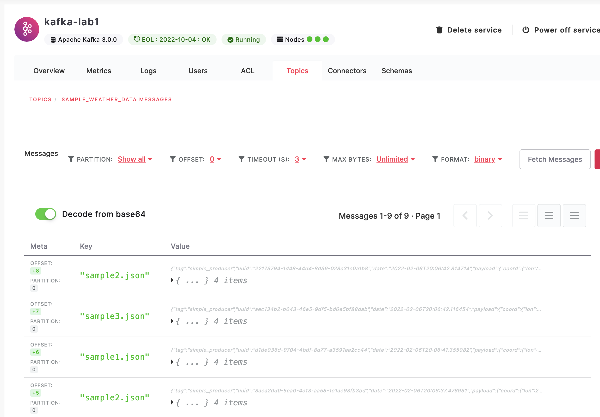
</p>

<p align="center">
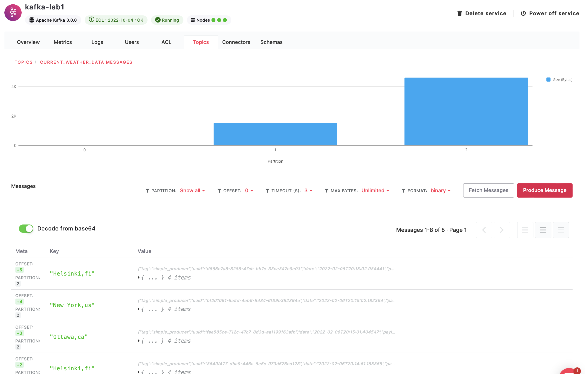
</p>

## Integration with InfluxDB and Graphana

### Creating a new InfluxDB service

Creating a new time series database from Aiven console can't be more simple. Just click on *Create new service* and select InfluxDB;

- Select a cloud provider and region
- Select the service plan and note the monthly cost
- Give the new service a name, example *influx-lab1*

### Creating a new Grafaana service

Creating a new Grafana service from Aiven console can't be more simple. Just click on *Create new service* and select Grafana;

- Select a cloud provider and region
- Select the service plan and note the monthly cost
- Give the new service a name, example *grafana-lab1*

### Integrating Kafka to InfluxDB

From the Kafka service console, click on Service Integrations, select *Metrics* and specify the InfluxDB service from the available dropdown.

<p align="center">
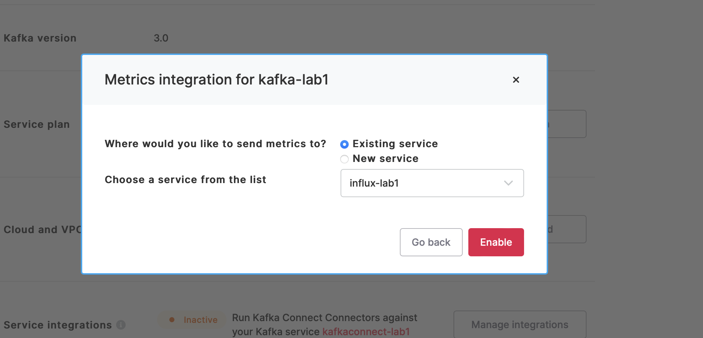
</p>

### Integrating InfluxDB to Grafana

From the InfluxDB service console, click on Service Integrations, select *Metrics* and specify the InfluxDB service from the available dropdown.

<p align="center">
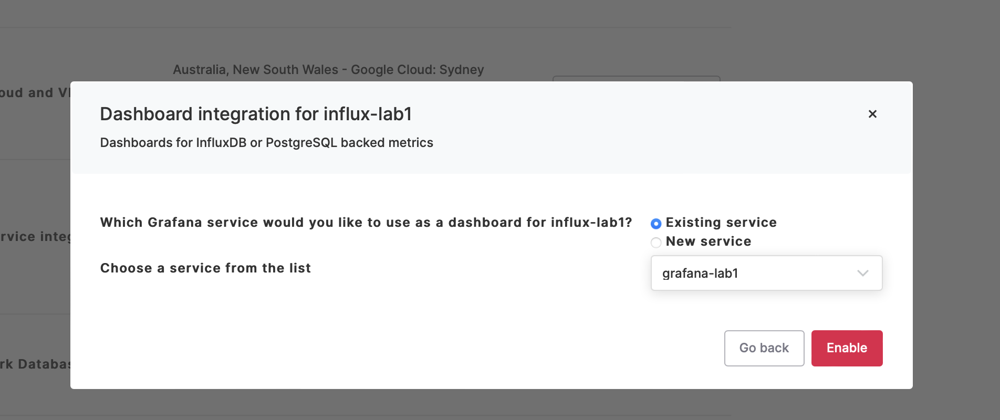
</p>


Aiven services will create, automatically in the background, connection credentials from Grafana to InfluxDB, as the screenshots below verify.

<p align="center">
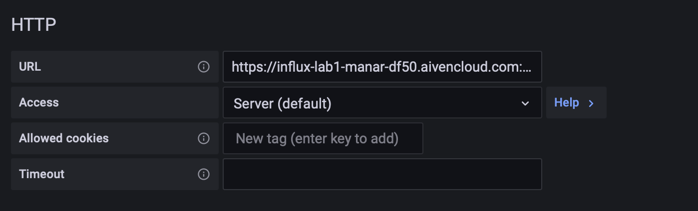
</p>

<p align="center">
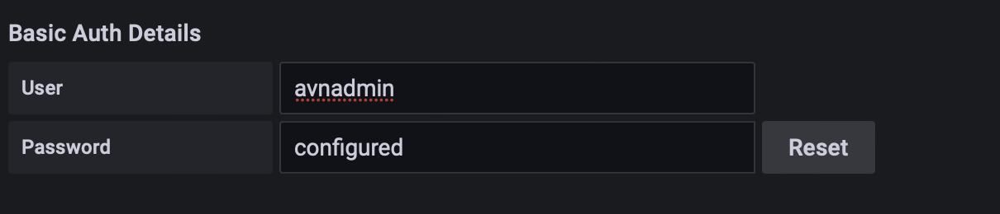
</p>

<p align="center">
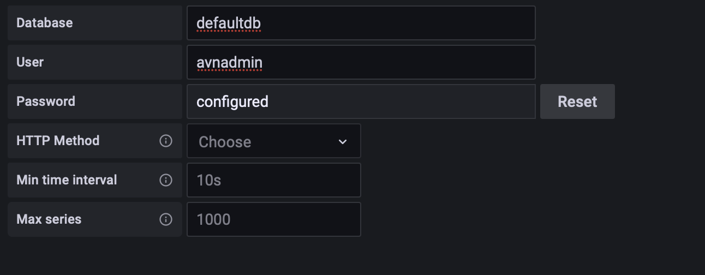
</p>


## Working with Grafana Console and Dashboards

### Acessing the Console

From the Grafana service page, follow  the Service URI link, and login using the service credentials.
Aiven will automatically provision a default Kafka dashboard if all integrations points are working as expected.
Click on Browse/dashboards from the left corner and it should be seen. The Dashboard will show some useful information about the Kafka Cluster.

#### System Metrics

<p align="center">
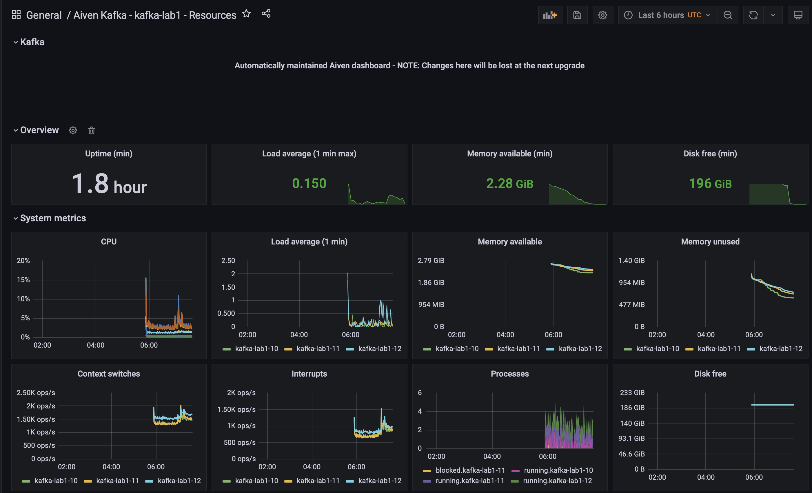
</p>

#### Kafka Metrics

<p align="center">
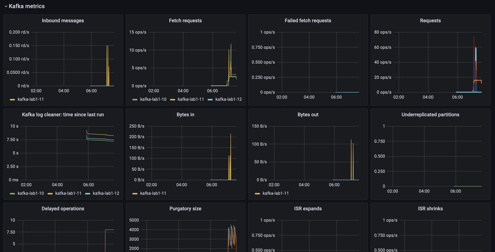
</p>

## Custom Visual
In this example, we will customise one of the existing visuals to show the total cumulative count of messages recieved by a particular topic;

- Dupliacte the *Inbound Messages* visual and rename the new duplicate to *Cumulative messages*. Save.
- add a condition in from condition *tpic = <topic-name>*
- select field(count)

Observe the count of incoming messages based on the topic and partition..
<p align="center">
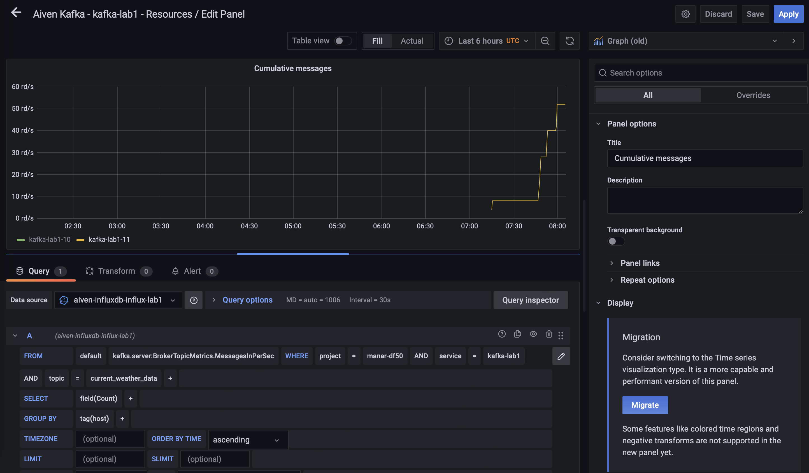
</p>

## Recap
In this docmument, we described a simple way to get started with Aiven kafka. Using the Aiven Console we quickly provisioned a new Kafka cluster and integrated with Influx DB and Grafana in no-time. We used simple Python code running on a PC to produce Telemetry data and send it to the Kafka Cluster, We then showcased the integartion pipeline and how the messages were consumed and sinked into a time-series database. We used the Aiven console andGrafana tool for visualisation and observability. 